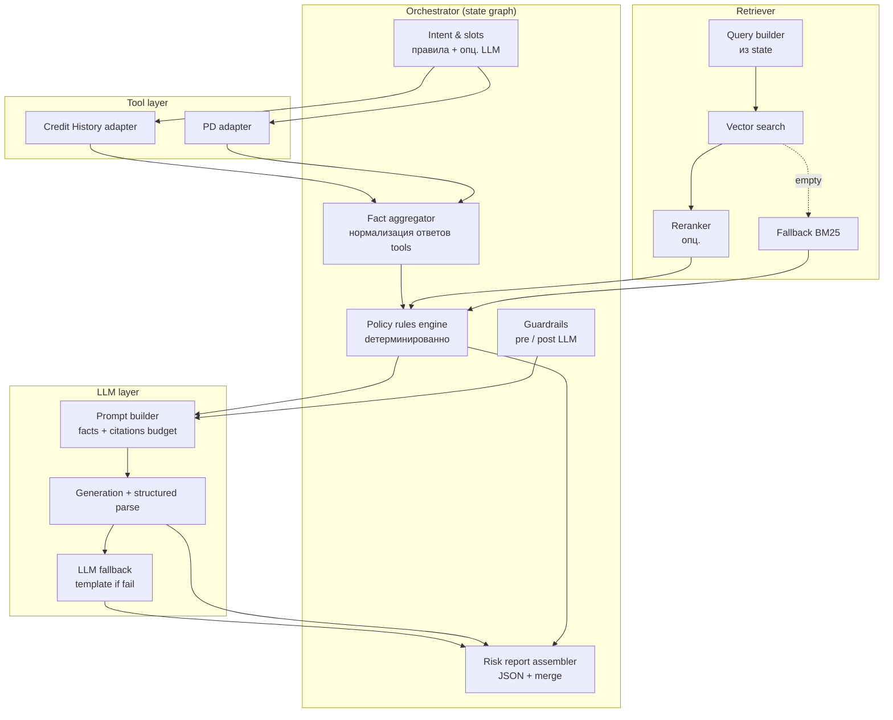

# C4 — Component (ядро системы)

Фокус: **оркестратор**, **retrieval** и **LLM-слой** — основа агентского трека.

**Поток ответственности:** Tools дают факты → Rules + Retriever дают соответствие политике → LLM **только** формулирует объяснение при прохождении guardrails → Assembler не позволяет decision расходиться с правилами.
