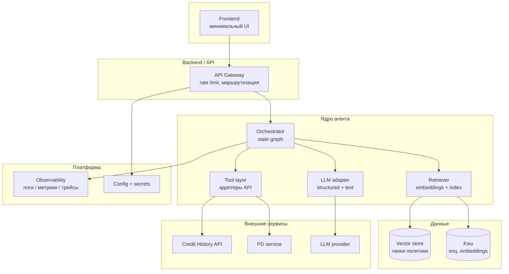

# C4 — Container

**Назначение контейнеров**

| Контейнер | Роль |
|-----------|------|
| Frontend | Ввод запроса, отображение отчёта и статусов |
| API Gateway | Единая точка входа, лимиты |
| Orchestrator | Граф шагов, state, ветки ошибок |
| Tool layer | Изолированные вызовы БКИ и PD |
| Retriever | Поиск по политике, citations |
| LLM adapter | Формирование промптов, парсинг ответа, retry |
| Vector store | Индекс политики |
| Observability | Без сырых ПДн в логах по политике governance |
