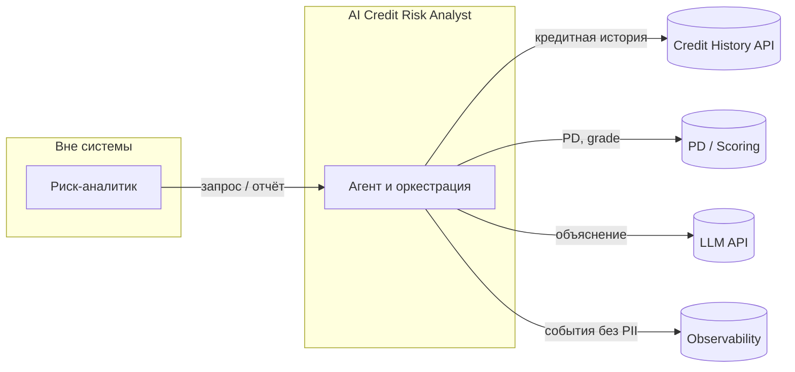

# C4 — Context

Уровень **Context**: пользователь, система PoC, внешние сервисы. Диаграмма в стандартном Mermaid (рендер на GitHub).

**Граница ответственности:** аналитик не обращается напрямую к БКИ/PD/LLM; все вызовы идут через PoC (контроль контрактов, таймаутов, guardrails).
