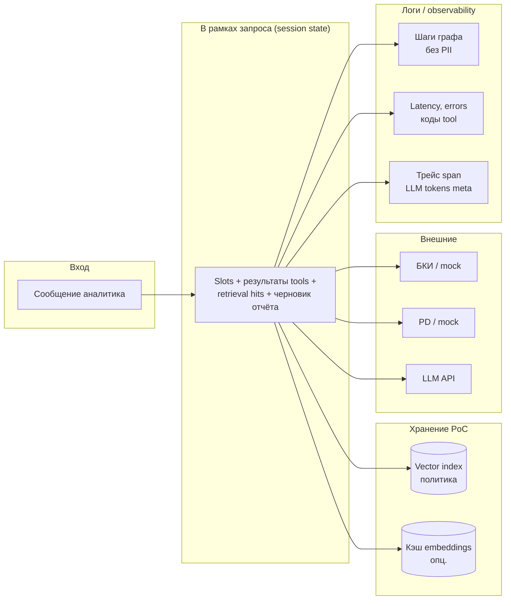

# Data flow — данные, хранение, логирование

Показывает, **что** течёт через систему, **где** хранится и **что** попадает в логи (без дублирования полного текста system-design).

**Что хранится**

| Данные | Где | PoC |
|--------|-----|-----|
| Чанки кредитной политики + embeddings | Vector store + файлы источников | Да |
| Профиль заёмщика между сессиями | — | Нет |
| Сессионный state | Память процесса / Redis опц. | Только на время запроса |

**Что логируется**

| Категория | Содержимое | Чего нет |
|-----------|------------|----------|
| Шаги оркестратора | Имена узлов, длительность, success/fail | ФИО, полный текст БКИ |
| Tools | Код ответа, latency, **обезличенный** client_id hash | Сырые ответы API с ПДн |
| Retrieval | k, similarity stats, id чанков | Полный текст чанков в production-логах — по политике |
| LLM | Модель, токены in/out, retry | Содержимое промпта с PII — маскирование |

Согласование с `docs/governance.md`: минимизация ПДн, структурированные логи.
