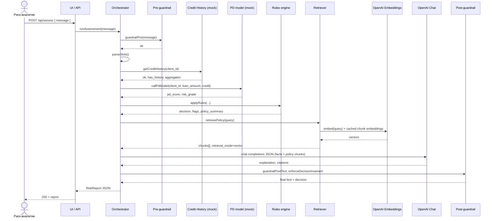

# Sequence diagram — happy path

Основной успешный сценарий: запрос аналитика → инструменты → правила → RAG → LLM → отчёт **без** деградации и без срабатывания guardrail на отказ.

**Примечание:** при отсутствии `OPENAI_API_KEY` шаги Emb/LLM заменяются на BM25-only retrieval и шаблонное объяснение (не показано на диаграмме как happy-path с LLM).
