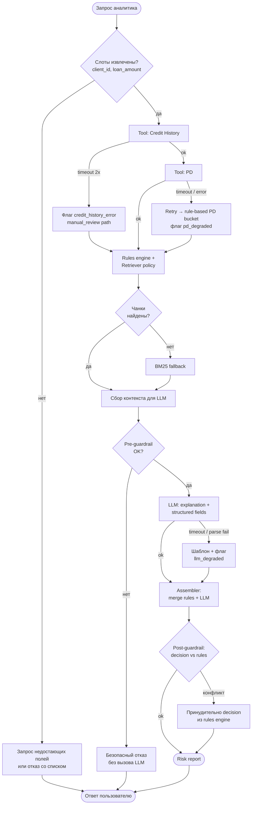

# Workflow / graph — выполнение запроса и ветки ошибок

**Условные остановки (stop conditions)**

- Успех: собран `RiskReport`, post-guardrail пройден.
- Частичный успех: сработал fallback (PD/retriever/LLM) — отчёт выдан с **флагами**, не маскируя деградацию.
- Отказ без LLM: pre-guardrail или домен вне кредитного риска — короткий ответ без вызова тяжёлых сервисов.
